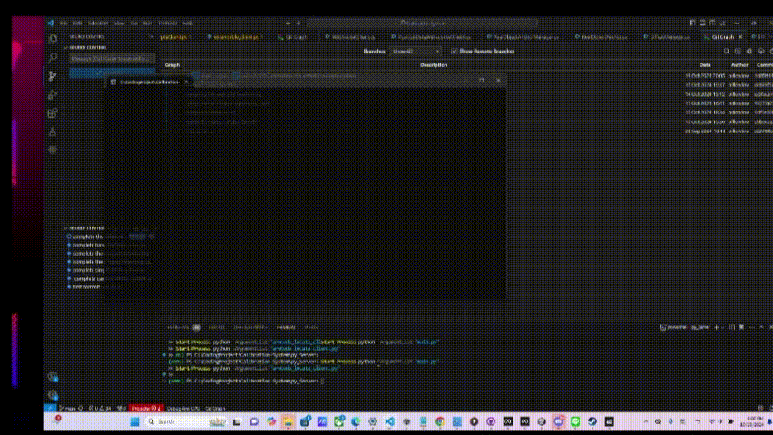
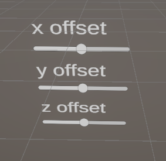
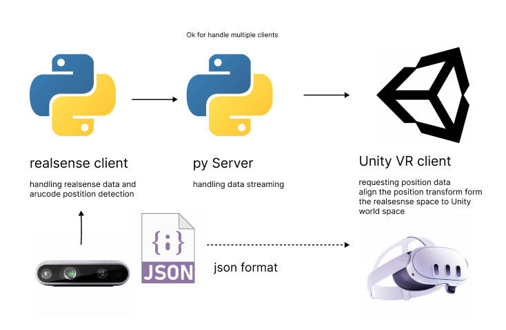

# VR- CV-Depth Camera Base Calibration System

## Abstract

This project integrates Unity VR(Meta all in one sdk) with a RealSense camera and a Python-based WebSocket server-client system to create a seamless interaction between the physical and virtual worlds. It allows users to adjust the virtual camera's position by grabbing and moving a Camera Anchor, which automatically updates all real object tracking anchors. The system also includes a calibration offset adjustment panel and modular server-client communication using JSON for data exchange, making it adaptable to various use cases, including object detection and real-time VR applications.

## Simple Demo

Below is a simple demo showcasing the core features of the system:


## Get Started

To set up and run this project, you'll need the following hardware and software components.

### Hardware Requirements
- **Meta Quest 3**: VR headset for interaction.
- **Intel RealSense Camera**: For capturing depth and RGB data.
- **Windows Machine**: A Windows PC with a recommended GPU, **NVIDIA RTX 2060 or higher**.

### Software Requirements
- **Unity Engine**: Version **2022.3.9f1** or later.
- **Meta Quest Link**: To connect your Meta Quest headset to the PC.
- **Meta Quest Developer Hub** (recommended): For managing and deploying the VR app.
- **Python 3.11** (recommended): To run the server-side components of the system.

### Installation Instructions

1. **Set up Meta Quest Link**:
   - Download and install the **Meta Quest Link** software from the official Oculus/Meta website.
   - Ensure your Meta Quest 3 is connected to your PC via a USB-C cable or over Wi-Fi using Air Link.

2. **Install Unity Engine**:
   - Download and install **Unity Hub** from [Unity's website](https://unity.com/download).
   - Install **Unity 2022.3.9f1** or later through Unity Hub.

3. **Set up Python**:
   - Download and install **Python 3.10** from [Python's website](https://www.python.org/downloads/).
   - Make sure to check the box for "Add Python to PATH" during installation.

4. **Install Meta Quest Developer Hub** (Optional but recommended):
   - Download the **Meta Quest Developer Hub** from the Meta Developers website to help with managing and debugging the app on the Meta Quest 3.

5. **Python Virtual Environment Setup:**

   - To ensure that the Python environment is correctly isolated, follow these steps to set up and activate a virtual environment in the `py_Server` directory.
   - Navigate to the `py_Server` Directory:
   In your terminal or command prompt, navigate to the `py_Server` directory where the Python server files are located:
   ```bash
   cd py_Server
   ```
   and run 
   ```
   .\venv\Scripts\activate

   ```
   to start virtaul environemnt 
   and finally  run

    ```
    pip install -r requirements.txt
   ``` 
    to setup your python environment

### Get Started

Once the environment is set up, follow these steps to run the project:

1. **Plug in the RealSense Camera**:
   - Ensure that your RealSense camera is connected to your Windows machine and the necessary drivers are installed.

2. **Start the Python Server and Client**:
   - Navigate to the `py_Server` directory in your terminal.
   - First, run the Python server:
     ```bash
     Start-Process python -ArgumentList "main.py"
      Start-Process python -ArgumentList "aruCode_locate_client.py"

     ```
   - You will see two windows appear. Press the **Start** button on the server window, and it will display the IP address of the server.

   

3. **Connect the RealSense Client**:
   - In the camera client window, enter the server IP address and press the **Start** button. This will start the RealSense camera streaming with ArUco marker detection.

4. **Open Unity and Set Up Meta Quest 3**:
   - Launch **Unity** and open the project.
   - Connect your Meta Quest 3 to the PC via **Oculus Link**.
   - Once connected, in Unity, build and run the `ShowCase_Game` scene.


   

5. **Align the Virtual Camera Anchor**:
   
   - In the Unity scene, you will see a blue **Camera Anchor**. Place it over the real position of the RealSense camera in the physical world to align the virtual and physical cameras.
   - Once the Camera Anchor is correctly placed, the ArUco markers will be detected, and anchors will be spawned at their corresponding positions in the virtual space.

6. **Adjust Calibration with the Offset Panel**:
   - In the Unity scene, there is a panel with X, Y, and Z sliders. Use these sliders to adjust the XYZ offsets for better alignment and calibration of the system.
   
By following these steps, you will have the system running with RealSense camera data streaming into Unity, allowing you to adjust calibration and interact with the physical and virtual world in real-time.

### Project Structure

This project consists of a Unity VR application built using the Meta All-In-One SDK, along with a Python environment for handling RealSense camera data and computer vision tasks. The components communicate via WebSocket using JSON-formatted instructions.

#### 1. RealSense Camera Client (Python)
- **Role**: Handles RealSense camera data, performs ArUco marker detection, and sends the resulting position data to the server.
- **Key Tasks**:
  - Processes real-world data from the RealSense camera.
  - Detects ArUco markers for tracking positions in the physical world.
  - Sends detected marker positions to the server using WebSocket.

#### 2. Python Server
- **Role**: Acts as an intermediary between the RealSense Camera Client and the Unity VR Client. It relays position and marker data from the camera client to the Unity VR client.
- **Key Tasks**:
  - Receives data from the RealSense Camera Client.
  - Processes and forwards this data to the Unity VR Client.
  - Handles multiple client connections and ensures smooth data flow.

#### 3. Unity VR Client
- **Role**: Receives position data from the Python server and uses it to update virtual objects in the VR environment, ensuring alignment between physical and virtual space.
- **Key Tasks**:
  - Receives position and marker data from the Python server.
  - Updates the virtual camera and object anchors in the VR scene based on the RealSense data.
  - Allows interaction and calibration using a Camera Anchor in VR.

#### System Architecture Diagram

Below is a visual representation of the system architecture:



- The **RealSense Camera Client** processes camera data and detects ArUco markers.
- The **Python Server** relays messages between the RealSense client and Unity VR client.
- The **Unity VR Client** updates virtual objects based on the RealSense camera data.

This structure ensures smooth communication between the physical and virtual environments.


